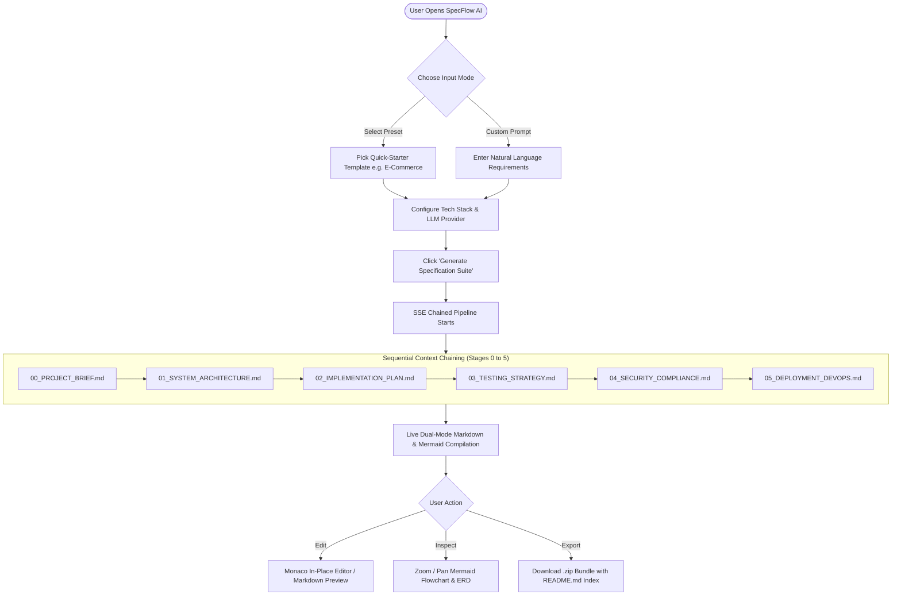

# 00_PROJECT_BRIEF.md: Product Scope & Requirements

## 1. Executive Summary & Problem Statement

### 1.1 Business Objective & Value Proposition
**SpecFlow AI** is an automated **Spec-Driven Development (SDD) Dashboard and Artifact Generator** designed to bridge the gap between high-level conceptual ideas and production-grade software execution. By transforming natural language application descriptions into a structured, sequential, 6-document engineering specification suite (`00_PROJECT_BRIEF.md` through `05_DEPLOYMENT_DEVOPS.md`), SpecFlow AI eliminates ambiguity, prevents architectural drift, and establishes an authoritative contract for engineering teams and AI coding agents.

- **Primary Goal:** Enable engineering leads, architects, and developers to generate an end-to-end, production-ready specification bundle in under 60 seconds.
- **Core Value Proposition:** Eliminates weeks of manual architecture drafting, guarantees cross-document consistency (database schemas match API routes, which match implementation tasks and deployment scripts), and provides an interactive, live-rendering workspace with one-click export.
- **Execution Model:** Context-accumulating 6-stage chained LLM orchestration pipeline with real-time Server-Sent Events (SSE) streaming.

### 1.2 Core Problem Definition & Current Inefficiencies
Modern software development and AI-assisted engineering suffer from critical failure modes:
1. **Prompt Drift & Missing Context:** Ad-hoc prompts to LLMs yield fragmented code without architectural cohesion, missing database constraints, or omitted error handling.
2. **Architectural Inconsistency:** Database schema changes are often not propagated into API contracts, test suites, or infrastructure manifests, causing runtime bugs and deployment failures.
3. **High Architectural Overhead:** Writing comprehensive RFCs, ERDs, OpenAPI contracts, test plans, and security policies takes weeks of senior engineering bandwidth.
4. **Lack of Visual Feedback:** Engineers cannot easily inspect live Mermaid diagrams, test matrices, and directory trees before committing to development.

---

## 2. Target User Personas & Core Workflows

### 2.1 Persona Definitions

| Persona | Role & Focus | Primary Goals | Key Pain Points | Access Level |
| :--- | :--- | :--- | :--- | :--- |
| **P-1: Principal Architect / Tech Lead** | High-level system design, cross-cutting concerns, technology stack decisions. | Rapidly draft and review RFCs, ERD schemas, system topologies, and security boundaries. | Inconsistent documentation across teams, time sink in manual diagramming. | Lead Architect / Admin |
| **P-2: Full-Stack Software Engineer** | Implementation, coding, service integration, local development. | Access concrete directory structures, granular task checklists, and exact API contract schemas. | Ambiguous requirements, missing field definitions, untyped API contracts. | Developer / Contributor |
| **P-3: QA & Security Specialist** | Quality assurance, threat modeling, compliance, vulnerability mitigation. | Review test coverage matrices, mock payloads, Playwright E2E flows, and OWASP Top 10 mitigation blueprints. | Vague acceptance criteria, missing edge-case specifications, lack of RBAC clarity. | QA & Security Reviewer |
| **P-4: DevOps & Platform Engineer** | CI/CD automation, containerization, cloud infrastructure, observability. | Obtain copy-paste ready multi-stage Dockerfiles, docker-compose setups, GitHub Actions workflows, and Terraform specs. | Inconsistent environment variables, missing health checks, ad-hoc Docker configurations. | DevOps & Infrastructure Lead |

### 2.2 Core User Workflows & Journeys

#### Workflow 1: Rapid Specification from Quick-Starter Template
1. User navigates to SpecFlow AI dashboard.
2. User clicks a pre-built template pill (e.g., *E-Commerce Microservices* or *Real-Time Collab & Chat*).
3. The prompt console, architecture toggles (Frontend, Backend, Database, Cloud), and recommended settings auto-populate.
4. User clicks **"Generate Specification Suite"**.
5. The 6-stage pipeline executes sequentially; tokens stream into the active workspace tab in real time with progress badges pulsing.
6. User reviews the generated Markdown, inspects interactive Mermaid diagrams, and downloads the `.zip` archive.

#### Workflow 2: Bespoke Project Specification with Custom Stack
1. User types or pastes detailed application requirements into the expandable prompt console.
2. User customizes tech stack toggles (e.g., Frontend: Next.js 14, Backend: FastAPI, Database: PostgreSQL, Auth: OAuth2/JWT).
3. User selects LLM provider (OpenAI, Anthropic, Gemini, Groq, Ollama, or Built-in High-Fidelity Synthesizer).
4. Generation executes with accumulated context chaining.
5. User toggles **Edit Mode** (Monaco Editor) to make in-place adjustments to `01_SYSTEM_ARCHITECTURE.md`.
6. User exports the updated specification suite.

---

## 3. Functional Requirements Matrix

| Requirement ID | Module / Area | Feature Description | Priority | Acceptance Criteria |
| :--- | :--- | :--- | :---: | :--- |
| **FR-101** | Input Console | Multi-line expandable prompt textarea with character/word counter and prompt enhancer. | **P0** | Accepts up to 10,000 characters; auto-expands with content; supports clear and reset actions. |
| **FR-102** | Template Presets | Pre-built quick-starter templates for popular architectural archetypes. | **P0** | At least 6 templates available; selecting a template populates prompt and tech stack settings instantly. |
| **FR-103** | Architecture Toggles | Configurable controls for Frontend, Backend, Database, Architecture Style, and Deployment. | **P0** | Selected values are injected into system prompts across all 6 generation phases. |
| **FR-104** | Multi-Provider Engine | Configurable LLM providers (OpenAI, Anthropic, Gemini, Groq, Ollama, Mock Mode). | **P0** | Supports custom API keys via UI modal or server env vars; falls back cleanly to High-Fidelity Synthesizer. |
| **FR-105** | Chained Pipeline | 6-stage sequential generation engine passing accumulated context to subsequent stages. | **P0** | Stage \(N\) receives accumulated text from Stages \(0 \dots N-1\); entity names and API routes remain 100% consistent. |
| **FR-106** | Real-Time SSE Stream | Server-Sent Events streaming token chunks to frontend with standardized JSON event frames. | **P0** | Emits \`stage_start\`, \`chunk\`, \`stage_complete\`, \`pipeline_complete\`, and \`error\` events without packet drops. |
| **FR-107** | Pipeline Tracker | Visual checklist tracking 6 stages with status badges (*Idle*, *Generating*, *Completed*, *Failed*). | **P0** | Active stage shows pulsing indicator, elapsed duration ticker, and estimated token count. |
| **FR-108** | Tabbed Workspace | 6 document tabs corresponding to the 6 specification files plus Combined Master view. | **P0** | Clicking a tab displays document content immediately; active streaming auto-focuses current generating stage. |
| **FR-109** | Live Markdown Preview | GitHub Flavored Markdown renderer with tables, alerts, checklists, and code syntax highlighting. | **P0** | Renders headers, tables, callouts, and code blocks with syntax highlighting and copy buttons. |
| **FR-110** | Live Mermaid Compiler | Automatic extraction and SVG compilation of Mermaid flowcharts, ERDs, and sequence diagrams. | **P0** | Compiles valid Mermaid blocks; provides error boundary fallback, pan/zoom controls, and fullscreen view. |
| **FR-111** | In-Place Code Editor | Monaco Editor / Raw Markdown editor toggle for manual edits and refinements. | **P1** | User can edit content directly; edits are preserved in active state and reflected in preview and ZIP export. |
| **FR-112** | Single File Actions | Copy Markdown to clipboard, download individual \`.md\` file, and print/PDF view. | **P1** | Copy button copies full raw Markdown; triggers temporary checkmark confirmation. |
| **FR-113** | Batch ZIP Export | One-click download packaging \`.specs/\` folder with all 6 \`.md\` files and master \`README.md\` index. | **P0** | Produces sanitized \`.zip\` archive containing \`00_PROJECT_BRIEF.md\` through \`05_DEPLOYMENT_DEVOPS.md\` and \`README.md\`. |
| **FR-114** | Selective Regeneration | Ability to re-generate an individual stage while retaining prior stage context. | **P1** | Clicking "Re-generate" on Stage 2 re-runs Stage 2 prompt with Stage 0 & 1 context without resetting all files. |
| **FR-115** | Diff Viewer | Visual side-by-side diff comparing original vs edited or re-generated specifications. | **P2** | Highlights additions (+) in green and deletions (-) in red with unified or split view. |

---

## 4. Non-Functional Requirements & SLA Commitments

### 4.1 Latency & Performance Targets
- **Time to First Token (TTFT):** < 500ms for High-Fidelity Synthesizer; < 1.5s for Cloud LLM APIs.
- **Streaming Throughput:** 40–80 tokens/second for smooth live visual reading experience.
- **UI Responsiveness:** 60fps rendering during active streaming; DOM updates debounced to prevent layout thrashing.
- **Mermaid Compilation:** < 100ms compilation time for complex 50-node diagrams.

### 4.2 Availability & Resilience (99.99% SLA)
- **Zero-Dependency Guarantee:** Built-in High-Fidelity Synthesizer ensures the application is 100% functional out of the box with zero external API keys required.
- **Fault-Tolerant Streaming:** If an external LLM API returns a 429 Rate Limit or 500 Server Error, the orchestrator emits a user alert and smoothly falls back to synthesis without crashing the UI.
- **Abort Controller Support:** Users can cancel an in-flight generation stream at any time with instantaneous stream termination.

### 4.3 Security & Privacy Standards
- **API Key Isolation:** User API keys entered in the UI are held exclusively in browser memory / `localStorage` and sent directly to the LLM endpoint; keys are never persisted to a database or logged.
- **Content Sanitization:** Markdown rendering engine strictly sanitizes HTML tags to prevent Cross-Site Scripting (XSS).
- **No Watermarks:** Generated specifications are pure, clean, professional human-authored engineering documents with zero AI attribution watermarks.

### 4.4 Portability & Cross-Platform Compatibility
- **Client Environments:** Compatible with modern evergreen web browsers (Chrome 110+, Edge 110+, Firefox 115+, Safari 16+).
- **Deployment Targets:** Zero-config execution on Node.js 18+, Docker, Vercel, AWS ECS, GCP Cloud Run.

---

## 5. Scope Boundaries

### 5.1 Explicitly In-Scope for MVP
- End-to-end chained 6-stage specification generator covering `00_PROJECT_BRIEF.md` through `05_DEPLOYMENT_DEVOPS.md`.
- Multi-provider support (OpenAI, Anthropic, Gemini, Groq, Ollama, and Mock/Synthesizer mode).
- Real-time Server-Sent Events (SSE) streaming architecture.
- Two-pane split layout with controller panel and tabbed workspace viewer.
- Live Mermaid.js diagram compilation with pan/zoom and fullscreen modal.
- Monaco code editor / raw Markdown toggle with in-place editing.
- Client-side one-click `.zip` bundle export containing `.specs/` folder and root `README.md` index.
- 6 pre-configured quick-starter templates.

### 5.2 Explicitly Out-of-Scope (Deferred to Phase 2+)
- Automated GitHub Pull Request creation directly to third-party repositories.
- Live multi-user multiplayer collaborative editing via WebSockets / CRDTs.
- Automatic backend code synthesis and code compilation execution in Docker sandboxes.
- Voice prompt input and speech-to-text transcription.

### 5.3 Technical Assumptions & External Dependencies
- Node.js runtime `v18.0.0` or higher (tested on Node.js `v22.16.0`).
- Modern browser with ES2022 and `ReadableStream` / `EventSource` / `fetch` streaming support.
- Tailwind CSS and Next.js App Router for dynamic client/server rendering.
