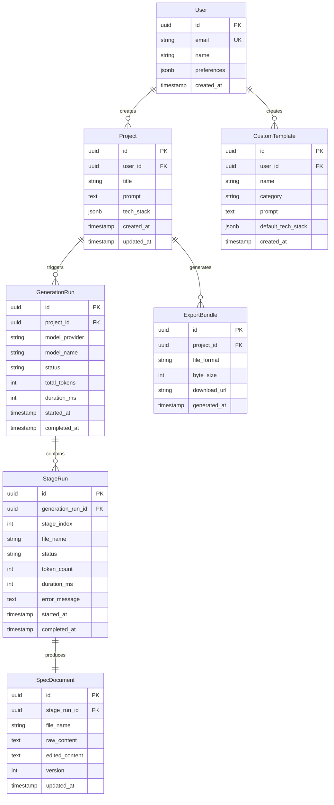
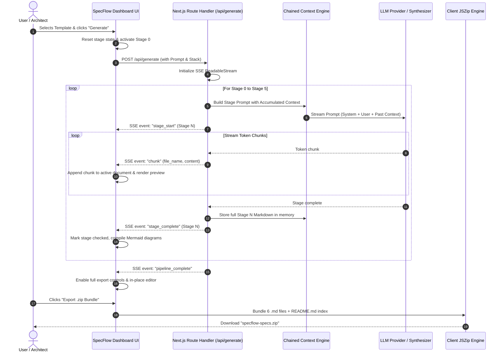

# 01_SYSTEM_ARCHITECTURE.md: System Design & Contracts

## 1. Technology Stack Selection & Architectural Rationale

| Layer | Chosen Technology | Architectural Rationale & Justification |
| :--- | :--- | :--- |
| **Frontend Framework** | Next.js 14 (App Router) + React 18 | Combines server-side route handlers with client-side reactive components. Zero-configuration SSR and asset bundling. |
| **Styling & Design System** | Tailwind CSS + Lucide Icons | Utility-first CSS provides high design density, responsive two-pane grid layout, dark mode styling, and minimal bundle footprint. |
| **Markdown Processing** | `react-markdown` + `remark-gfm` + `rehype-highlight` | Native AST-based Markdown parsing with full GitHub Flavored Markdown (GFM) tables, task checklists, and syntax highlighting. |
| **Visual Diagramming** | `mermaid.js` (v11+) | Client-side dynamic SVG compilation for Flowcharts, ERDs, Sequence diagrams, and Gantt charts without external graphic dependencies. |
| **In-Place Editor** | `@monaco-editor/react` | The VS Code editor in the browser: provides syntax coloring, line numbers, folding, multi-cursor editing, and search/replace. |
| **Backend & Orchestration** | Next.js Edge / Node Route Handlers | Native Node.js stream capabilities (`ReadableStream` / `TextEncoder`) deliver low-latency Server-Sent Events (SSE) streaming. |
| **LLM Provider Gateway** | Multi-Provider Streaming Gateway | Abstracted provider layer supporting OpenAI (`gpt-4o`), Anthropic (`claude-3-5-sonnet`), Google Gemini (`gemini-2.0-flash`), Groq, Ollama, and built-in High-Fidelity Synthesizer. |
| **Client Archive Engine** | `jszip` + `file-saver` | Fast client-side `.zip` archive creation for the `.specs/` folder with zero server storage overhead. |

---

## 2. Visual System Topology

```mermaid
flowchart TD
    subgraph ClientWorkspace ["Browser Client Workspace (Next.js / React 18)"]
        UI["SpecFlow AI Master Dashboard"]
        
        subgraph Controller ["Left Pane: Controller"]
            PromptBox["Prompt Console & Enhancer"]
            Templates["6 Quick-Starter Template Pills"]
            StackToggles["Tech Stack & Architecture Selectors"]
            ProviderModal["LLM Provider & API Key Modal"]
            Tracker["6-Stage Pipeline Progress Tracker"]
        end

        subgraph Viewer ["Right Pane: Workspace Viewer"]
            TabBar["6 Document Tabs + Master Index"]
            ViewToggle["Split / Preview / Monaco Editor Modes"]
            MarkdownEngine["React-Markdown + GFM Renderer"]
            MermaidEngine["Live Mermaid.js SVG Compiler & Zoom"]
            MonacoView["Monaco In-Place Code Editor"]
            ExportTrigger["ZIP Archive & File Exporters"]
        end
    end

    subgraph ServerOrchestrator ["Next.js Server / API Runtime"]
        SSEEndpoint["POST /api/generate (SSE Route Handler)"]
        ContextChainer["Sequential Context Accumulator"]
        StagePromptBuilder["Stage-Specific Prompt Formatter"]
        ProviderRouter["LLM Provider Dispatcher"]
    end

    subgraph LLMAdapters ["LLM Provider Gateway"]
        OpenAIAdapter["OpenAI API (gpt-4o / gpt-4o-mini)"]
        AnthropicAdapter["Anthropic API (claude-3-5-sonnet)"]
        GeminiAdapter["Google Gemini API (gemini-2.0-flash)"]
        GroqAdapter["Groq API (llama-3.3-70b)"]
        OllamaAdapter["Local Ollama (localhost:11434)"]
        MockSynthesizer["Built-in High-Fidelity Synthesizer Engine"]
    end

    UI --> Controller
    UI --> Viewer
    PromptBox --> SSEEndpoint
    Templates --> PromptBox
    StackToggles --> SSEEndpoint
    ProviderModal --> SSEEndpoint

    SSEEndpoint --> ContextChainer
    ContextChainer --> StagePromptBuilder
    StagePromptBuilder --> ProviderRouter

    ProviderRouter --> OpenAIAdapter
    ProviderRouter --> AnthropicAdapter
    ProviderRouter --> GeminiAdapter
    ProviderRouter --> GroqAdapter
    ProviderRouter --> OllamaAdapter
    ProviderRouter --> MockSynthesizer

    OpenAIAdapter -->|Token Stream| ContextChainer
    AnthropicAdapter -->|Token Stream| ContextChainer
    GeminiAdapter -->|Token Stream| ContextChainer
    GroqAdapter -->|Token Stream| ContextChainer
    OllamaAdapter -->|Token Stream| ContextChainer
    MockSynthesizer -->|Token Stream| ContextChainer

    ContextChainer -->|SSE Event Frames| SSEEndpoint
    SSEEndpoint -->|SSE Stream via fetch()| UI
    UI --> Tracker
    UI --> MarkdownEngine
    UI --> MermaidEngine
    UI --> MonacoView
    Viewer --> ExportTrigger
```

---

## 3. Database Schema & Entity Relationship Diagram (ERD)

Although SpecFlow AI operates primarily client-side with persistent `localStorage` and stateless streaming, enterprise deployments can persist generation runs, custom templates, and organizational specifications using this schema:



### 3.1 Data Dictionary & Table Specifications

#### Table: `projects`
- **`id`**: `UUID` (Primary Key, default: `gen_random_uuid()`)
- **`user_id`**: `UUID` (Foreign Key -> `users.id` ON DELETE CASCADE)
- **`title`**: `VARCHAR(255)` (NOT NULL)
- **`prompt`**: `TEXT` (NOT NULL)
- **`tech_stack`**: `JSONB` (Stores frontend, backend, database, architecture, deployment choices)
- **`created_at`**: `TIMESTAMPTZ` (NOT NULL, default: `CURRENT_TIMESTAMP`)

#### Table: `spec_documents`
- **`id`**: `UUID` (Primary Key)
- **`stage_run_id`**: `UUID` (Foreign Key -> `stage_runs.id` ON DELETE CASCADE)
- **`file_name`**: `VARCHAR(100)` (e.g. `01_SYSTEM_ARCHITECTURE.md`)
- **`raw_content`**: `TEXT` (Original generated Markdown)
- **`edited_content`**: `TEXT` (User modified content from in-place Monaco editor)
- **`version`**: `INTEGER` (Incremented upon manual edits or selective re-generations)

---

## 4. RESTful & Real-time API Contracts

### 4.1 Endpoint: Chained SSE Specification Generator
```http
POST /api/generate
Content-Type: application/json
Accept: text/event-stream
```

#### Request Payload:
```json
{
  "prompt": "Build a real-time collaborative workspace with video rooms and CRDT documents",
  "techStack": {
    "frontend": "Next.js 14 + Tailwind CSS",
    "backend": "FastAPI + Go WebSocket Gateway",
    "database": "PostgreSQL + Redis",
    "architecture": "Event-Driven Microservices",
    "deployment": "Docker + Kubernetes",
    "auth": "OAuth 2.0 / JWT + RBAC",
    "caching": "Redis Cluster"
  },
  "llmConfig": {
    "provider": "openai",
    "model": "gpt-4o",
    "temperature": 0.3,
    "apiKey": "sk-proj-..."
  },
  "targetStage": null,
  "accumulatedContext": {}
}
```

#### Server-Sent Events (SSE) Response Stream:

##### 1. Event: `stage_start`
```json
data: {
  "event": "stage_start",
  "stage_index": 0,
  "file_name": "00_PROJECT_BRIEF.md",
  "message": "Analyzing requirements and synthesizing project brief..."
}
```

##### 2. Event: `chunk` (Repeated token stream)
```json
data: {
  "event": "chunk",
  "stage_index": 0,
  "file_name": "00_PROJECT_BRIEF.md",
  "content": "## 1. Executive Summary\nSpecFlow AI enables..."
}
```

##### 3. Event: `stage_complete`
```json
data: {
  "event": "stage_complete",
  "stage_index": 0,
  "file_name": "00_PROJECT_BRIEF.md",
  "tokens_generated": 1420,
  "duration_ms": 4200
}
```

##### 4. Event: `pipeline_complete`
```json
data: {
  "event": "pipeline_complete",
  "total_tokens": 9850,
  "duration_ms": 28400
}
```

##### 5. Event: `error`
```json
data: {
  "event": "error",
  "stage_index": 2,
  "file_name": "02_IMPLEMENTATION_PLAN.md",
  "error_message": "Rate limit exceeded on OpenAI API. Switched to fallback synthesizer."
}
```

---

## 5. Data Flow & Event Bus Architecture


