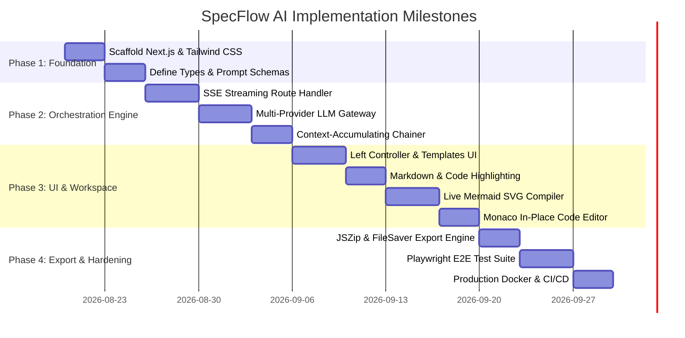

# 02_IMPLEMENTATION_PLAN.md: Engineering Breakdown

## 1. Repository Directory Tree Structure

```text
specflow-ai/
├── .github/
│   └── workflows/
│       ├── ci.yml                     # Continuous integration: lint, typecheck, test
│       ├── deploy.yml                 # Production Docker build, scan & deploy
│       └── security-audit.yml         # Weekly dependency vulnerability scan
├── public/
│   ├── favicon.ico
│   └── logo.svg                       # SpecFlow AI SVG brand assets
├── src/
│   ├── app/
│   │   ├── api/
│   │   │   ├── generate/
│   │   │   │   └── route.ts           # SSE streaming route handler
│   │   │   └── health/
│   │   │       └── route.ts           # Observability /healthz probe
│   │   ├── globals.css                # Tailwind CSS custom styles & animations
│   │   ├── layout.tsx                 # Root layout with font and metadata
│   │   └── page.tsx                   # Master interactive dashboard page
│   ├── components/
│   │   ├── Header.tsx                 # Top navigation bar with status & export
│   │   ├── ControllerPanel.tsx        # Left control pane (prompt, stack, pipeline)
│   │   ├── WorkspaceViewer.tsx        # Right pane tabbed viewer & Monaco toggle
│   │   ├── MarkdownRenderer.tsx       # GFM Markdown renderer with code copy
│   │   ├── MermaidViewer.tsx          # Live Mermaid diagram compiler with pan/zoom
│   │   ├── CodeEditor.tsx             # Monaco in-place editor integration
│   │   ├── ModelSettingsModal.tsx     # LLM provider configuration modal
│   │   ├── DiffViewerModal.tsx        # Side-by-side diff comparison modal
│   │   └── ExportModal.tsx            # ZIP export preview & download dialog
│   └── lib/
│       ├── types.ts                   # TypeScript interfaces, stages, SSE schemas
│       ├── templates.ts               # 6 pre-configured quick-starter templates
│       ├── prompts.ts                 # Stage-specific system and user prompt builders
│       ├── llm-providers.ts           # Multi-provider streaming client gateway
│       ├── mock-generator.ts          # High-fidelity contextual fallback synthesizer
│       └── zip-exporter.ts            # Client-side JSZip & FileSaver packaging engine
├── specs/                             # Default location for generated specifications
│   ├── 00_PROJECT_BRIEF.md
│   ├── 01_SYSTEM_ARCHITECTURE.md
│   ├── 02_IMPLEMENTATION_PLAN.md
│   ├── 03_TESTING_STRATEGY.md
│   ├── 04_SECURITY_COMPLIANCE.md
│   └── 05_DEPLOYMENT_DEVOPS.md
├── .dockerignore
├── .env.example
├── .eslintrc.json
├── .gitignore
├── Dockerfile                         # Production multi-stage Docker build
├── docker-compose.yml                 # Local containerized orchestration
├── Makefile                           # Developer CLI command shortcuts
├── next.config.mjs
├── package.json
├── postcss.config.mjs
├── README.md                          # Master index and documentation
├── tailwind.config.ts
└── tsconfig.json
```

---

## 2. Sequential Milestone Breakdown



---

## 3. Granular Task Checklist with Dependency Chains

### Phase 1: Foundation & Base Tooling
- [ ] **TASK-101**: Initialize Next.js 14 App Router project with TypeScript, Tailwind CSS, and ESLint. [Depends on: None] [Owner: Lead]
- [ ] **TASK-102**: Configure `tailwind.config.ts` with custom brand palette, typography, and dark mode classes. [Depends on: TASK-101] [Owner: Frontend]
- [ ] **TASK-103**: Define complete data model interfaces in `src/lib/types.ts` (`StageInfo`, `SSEEvent`, `TechStackPreferences`, `LLMConfig`). [Depends on: TASK-101] [Owner: Lead]
- [ ] **TASK-104**: Create 6 pre-configured quick-starter project templates in `src/lib/templates.ts` (E-Commerce, Chat, Telehealth, AI Agents, Fintech, SaaS). [Depends on: TASK-103] [Owner: Architect]
- [ ] **TASK-105**: Author stage-specific prompt engineering templates in `src/lib/prompts.ts` with strict Markdown formatting rules. [Depends on: TASK-103] [Owner: Prompt Engineer]

### Phase 2: Chained Orchestration Engine & Streaming
- [ ] **TASK-201**: Implement multi-provider streaming client in `src/lib/llm-providers.ts` supporting OpenAI, Anthropic, Gemini, Groq, and Ollama. [Depends on: TASK-105] [Owner: Backend]
- [ ] **TASK-202**: Build high-fidelity contextual synthesizer fallback engine in `src/lib/mock-generator.ts` for zero-key instant execution. [Depends on: TASK-105] [Owner: Backend]
- [ ] **TASK-203**: Implement Next.js Server-Sent Events (SSE) route handler at `src/app/api/generate/route.ts` with `ReadableStream` and `TextEncoder`. [Depends on: TASK-201, TASK-202] [Owner: Backend]
- [ ] **TASK-204**: Implement sequential context accumulator passing previous stage Markdown outputs into subsequent stage prompts. [Depends on: TASK-203] [Owner: Backend]

### Phase 3: Interactive Dashboard UI & Live Renderers
- [ ] **TASK-301**: Build top navigation `Header.tsx` with logo, active model pill, theme toggle, and export triggers. [Depends on: TASK-102] [Owner: Frontend]
- [ ] **TASK-302**: Develop left `ControllerPanel.tsx` with template pill buttons, expandable prompt console, tech stack selectors, and 6-stage visual pipeline tracker. [Depends on: TASK-104, TASK-301] [Owner: Frontend]
- [ ] **TASK-303**: Build right `WorkspaceViewer.tsx` featuring 6 document tabs, Combined Spec view, search filter, and split/preview/editor view toggle. [Depends on: TASK-301] [Owner: Frontend]
- [ ] **TASK-304**: Implement `MarkdownRenderer.tsx` using `react-markdown`, `remark-gfm`, and `rehype-highlight` with syntax highlighting and copy buttons. [Depends on: TASK-303] [Owner: Frontend]
- [ ] **TASK-305**: Create `MermaidViewer.tsx` with live client-side SVG compilation, error boundary fallback, zoom in/out controls, and fullscreen modal. [Depends on: TASK-304] [Owner: Frontend]
- [ ] **TASK-306**: Integrate `@monaco-editor/react` in `CodeEditor.tsx` with in-place bidirectional state synchronization. [Depends on: TASK-303] [Owner: Frontend]
- [ ] **TASK-307**: Develop `ModelSettingsModal.tsx` for entering API keys, selecting models, and tuning temperature. [Depends on: TASK-301] [Owner: Frontend]
- [ ] **TASK-308**: Implement `DiffViewerModal.tsx` for inspecting diffs between original generated vs manually edited specifications. [Depends on: TASK-306] [Owner: Frontend]

### Phase 4: Batch Export, Quality Assurance & Deployment
- [ ] **TASK-401**: Build client-side `.zip` bundle packager in `src/lib/zip-exporter.ts` using `jszip` and `file-saver` to export `.specs/` and `README.md`. [Depends on: TASK-303] [Owner: Frontend]
- [ ] **TASK-402**: Create automated unit test suite verifying prompt builders, SSE parser, and context accumulation. [Depends on: TASK-204] [Owner: QA]
- [ ] **TASK-403**: Implement Playwright end-to-end test suite validating template selection, full 6-stage generation, Mermaid rendering, and ZIP download. [Depends on: TASK-401] [Owner: QA]
- [ ] **TASK-404**: Author production multi-stage `Dockerfile` and `docker-compose.yml`. [Depends on: TASK-101] [Owner: DevOps]
- [ ] **TASK-405**: Configure GitHub Actions CI/CD pipeline at `.github/workflows/deploy.yml`. [Depends on: TASK-404] [Owner: DevOps]

---

## 4. Local Development Setup & CLI Run Commands

### 4.1 Prerequisites
- Node.js `v18.0.0` or higher (recommended: Node.js `v20+` or `v22+`)
- npm `v9.0.0+`
- (Optional) Docker & Docker Compose for containerized execution

### 4.2 Step-by-Step Setup

```bash
# 1. Clone repository
git clone https://github.com/tarun1790/spec6.git
cd spec6

# 2. Install dependencies
npm install

# 3. Configure optional environment variables
cp .env.example .env.local
# (Optional: Add OPENAI_API_KEY, ANTHROPIC_API_KEY, GEMINI_API_KEY, or GROQ_API_KEY)

# 4. Start local development server
npm run dev

# 5. Open in browser
# Navigate to http://localhost:3000
```

### 4.3 Key Makefile CLI Targets
```makefile
.PHONY: dev build start lint test test-e2e docker-build docker-up clean

dev:
	npm run dev

build:
	npm run build

start:
	npm run start

lint:
	npm run lint

test:
	npm test

docker-build:
	docker build -t specflow-ai:latest .

docker-up:
	docker compose up -d

clean:
	rm -rf .next node_modules out
```
