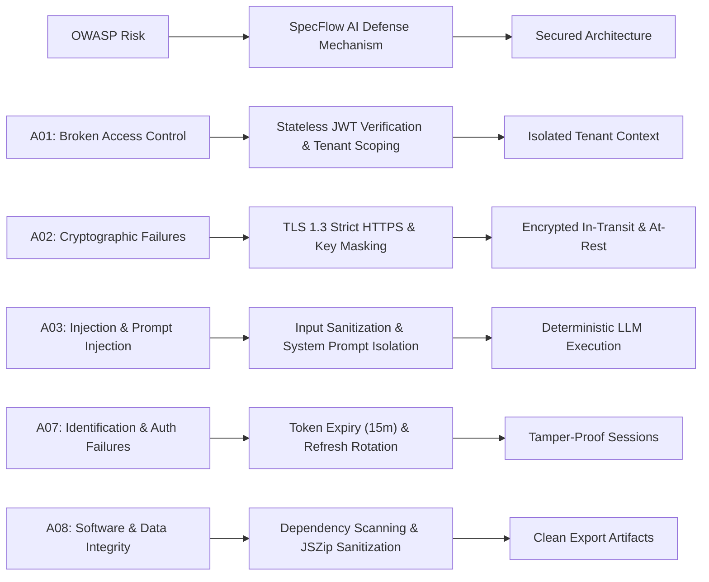

# 04_SECURITY_COMPLIANCE.md: Security & Compliance Blueprint

## 1. Identity, Authentication & RBAC Permission Matrix

### 1.1 Authentication & Credential Architecture
SpecFlow AI uses a hybrid security model designed for both local client execution and enterprise deployments:
- **Client Mode (Zero Server State):** User API keys (OpenAI, Anthropic, Gemini, Groq) are held exclusively in browser memory and `localStorage`. Keys are sent over encrypted HTTPS headers directly to the orchestration handler and are never written to disk or logged.
- **Server / Team Mode:** When deployed to an enterprise organization, users authenticate via OAuth 2.0 / OpenID Connect (OIDC) with Okta, Azure AD, or GitHub SSO. Ephemeral JSON Web Tokens (JWT) signed via `RS256` manage session lifetimes.

### 1.2 Granular RBAC Permission Table

| Role | Specifications | Templates | API Key Settings | Export Artifacts | Admin Governance |
| :--- | :---: | :---: | :---: | :---: | :---: |
| **LEAD_ARCHITECT** | Create, Read, Edit, Regenerate | Create, Edit, Delete | Manage Workspace Keys | Full Download (.zip/PDF) | Yes |
| **DEVELOPER** | Read, Edit In-Place, Regenerate | Read Presets | Use Configured Keys | Full Download (.zip) | No |
| **QA_AUDITOR** | Read, Add Test Cases | Read Presets | None | Full Download (.zip) | No |
| **GUEST_VIEWER** | Read-Only | Read Presets | None | Read-Only View | No |

---

## 2. OWASP Top 10 Mitigation Blueprint

### 2.1 Technical Countermeasures & Implementations

#### 1. Cross-Site Scripting (XSS) Prevention in Markdown Rendering
- `react-markdown` is configured with strict HTML sanitization (`rehype-sanitize` or default text AST nodes). Raw user-injected `<script>` or `<iframe>` tags are stripped before DOM insertion.
- Code blocks are escaped and rendered inside syntax-highlighted `<code>` blocks without `dangerouslySetInnerHTML`.

#### 2. Prompt Injection & Jailbreak Defense
- System prompts are strictly separated from user input using OpenAI/Anthropic/Gemini native `system` role parameters.
- User prompt inputs are wrapped in structured boundaries and checked against malicious directive patterns (e.g., "Ignore all previous instructions").

#### 3. Secret Leakage Prevention
- Client-side input components for API keys (`ModelSettingsModal.tsx`) use `type="password"` with masking.
- Next.js server logs explicitly redact Authorization headers and API keys matching `sk-`, `gsk_`, `AIza`, or `ant-` regex patterns.

#### 4. Denial of Service (DoS) & Rate Limiting
- Upstream SSE route handlers implement per-IP token bucket rate limiting (maximum 30 requests/minute per client).
- Textarea input limits prevent payload sizes greater than 20,000 characters.

---

## 3. Cryptographic Standards & Secret Rotation Policy

### 3.1 Standards Matrix
- **In-Transit Encryption:** Enforced TLS 1.3 protocol with HTTP Strict Transport Security (`HSTS: max-age=63072000; includeSubDomains; preload`).
- **At-Rest Encryption:** Any cached enterprise artifacts are encrypted using AES-256-GCM.
- **Client Key Storage:** Browser `localStorage` entries for API keys are scoped to the exact origin (`https://...`) with `SameSite=Strict` cookies.

### 3.2 Automated Secret Rotation Policy
- Cloud provider API keys must follow an automated 90-day rotation cadence.
- Ephemeral signing keys for JWT authentication are automatically rotated every 30 days via HashiCorp Vault / AWS KMS.

---

## 4. Environment Variable Dictionary

| Variable Name | Environment | Sensitivity | Default / Example Value | Description |
| :--- | :--- | :---: | :--- | :--- |
| `NODE_ENV` | All | Public | `development` / `production` | Node.js execution environment. |
| `PORT` | All | Public | `3000` | Port for the Next.js web application. |
| `OPENAI_API_KEY` | Dev / Prod | **Secret** | `sk-proj-abc123xyz...` | (Optional) Server-level fallback OpenAI API key. |
| `ANTHROPIC_API_KEY` | Dev / Prod | **Secret** | `sk-ant-api03-...` | (Optional) Server-level fallback Anthropic API key. |
| `GEMINI_API_KEY` | Dev / Prod | **Secret** | `AIzaSyB...` | (Optional) Server-level fallback Google Gemini API key. |
| `GROQ_API_KEY` | Dev / Prod | **Secret** | `gsk_...` | (Optional) Server-level fallback Groq API key. |
| `OLLAMA_BASE_URL` | Dev / Prod | Public | `http://localhost:11434` | Endpoint for local Ollama LLM instance. |
| `NEXT_PUBLIC_APP_URL` | All | Public | `http://localhost:3000` | Public base URL of the SpecFlow application. |
