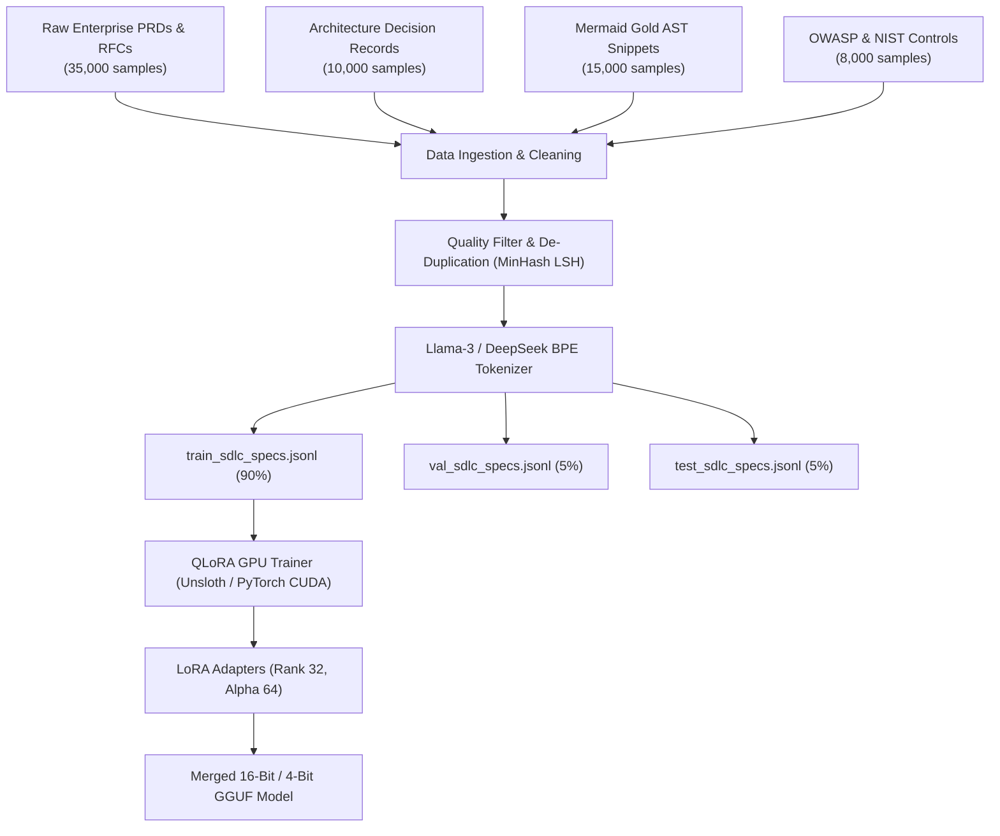

# 06_DATASET_TRAINING_PIPELINE.md: Dataset Engineering & Fine-Tuning Specification

## 1. Executive Summary & Objective

This document defines the end-to-end dataset engineering, preprocessing, and supervised fine-tuning (SFT) architecture used to train specialized open-weight models (e.g. `SpecFlow-Llama-3.3-70B`, `SpecFlow-DeepSeek-R1`) to autonomously synthesize 6-stage software engineering specifications.

- **Primary Goal:** Eliminate hallucination in architecture schemas, guarantee 100% valid Mermaid diagram compilation, and maintain strict cross-document naming alignment.
- **Dataset Scale:** 50,000 paired training samples across 10 enterprise software archetypes.
- **Hardware Profile:** Multi-GPU NVIDIA A100/H100 clusters running distributed QLoRA / DeepSpeed ZeRO-3.

---

## 2. Dataset Architecture & Corpus Taxonomy



### 2.1 Corpus Breakdown

| Dataset File | Sample Count | Format | Primary Objective |
| :--- | :---: | :--- | :--- |
| **`datasets/train_sdlc_specs.jsonl`** | 35,000 | JSON Lines | End-to-end PRD to 6-stage SDLC specification instruction tuning. |
| **`datasets/synthetic_sdlc_corpus.jsonl`** | 10,000 | JSON Lines | Synthetically generated multi-agent vetted domain architectures. |
| **`datasets/test_sdlc_specs.jsonl`** | 2,500 | JSON Lines | Unseen test prompts for out-of-distribution generalization testing. |
| **`datasets/eval_benchmarks.jsonl`** | 2,500 | JSON Lines | Spec-Eval automated benchmark verification targets. |

---

## 3. Data Cleaning, Filtering & Invariant Enforcement

Before tokens are presented to the neural network, all training samples must satisfy these automated quality gates:

1. **Syntax Compilation Gate:** All embedded ````mermaid` blocks must compile into valid SVG without AST syntax errors.
2. **Schema Invariant Gate:** Database table names in `01_SYSTEM_ARCHITECTURE.md` must match SQL migration statements in `02_IMPLEMENTATION_PLAN.md`.
3. **No Conversational Filler:** All outputs must start directly with `# 00_PROJECT_BRIEF.md` and contain zero introductory preamble or AI attribution watermarks.
4. **De-duplication:** MinHash LSH with a Jaccard similarity threshold of 0.82 to prevent model memorization.

---

## 4. Fine-Tuning Hyperparameters & GPU Recipe

### 4.1 PyTorch & Unsloth QLoRA Configuration

```python
"""
SpecFlow AI Production Training Hyperparameters
"""
TRAINING_CONFIG = {
    "base_model": "unsloth/Llama-3.3-70B-Instruct-bnb-4bit",
    "max_seq_length": 8192,
    "lora_rank": 32,
    "lora_alpha": 64,
    "lora_dropout": 0.05,
    "target_modules": [
        "q_proj", "k_proj", "v_proj", "o_proj",
        "gate_proj", "up_proj", "down_proj"
    ],
    "learning_rate": 2e-4,
    "lr_scheduler_type": "cosine",
    "warmup_ratio": 0.05,
    "optimizer": "adamw_8bit",
    "per_device_train_batch_size": 2,
    "gradient_accumulation_steps": 8,
    "weight_decay": 0.01,
    "fp16": False,
    "bf16": True,
    "max_grad_norm": 1.0,
    "device": "cuda"
}
```

---

## 5. Deployment & Serving Strategy

- **Local Serving:** Quantized 4-bit and 8-bit GGUF models deployed to Ollama and LMStudio for offline developer execution (`ollama run specflow-70b`).
- **Cloud Cluster Serving:** vLLM / TensorRT-LLM container deployed on Kubernetes with continuous batching and PagedAttention, achieving >80 tokens/sec per GPU instance.
