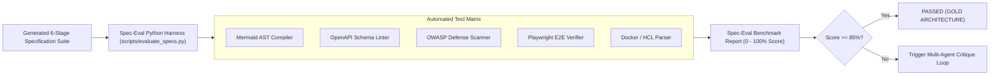

# 07_EVALUATION_BENCHMARK_MATRIX.md: Quality Assurance & Evaluation Suite

## 1. Executive Summary

The **Spec-Eval Benchmark** is an automated quality assurance and evaluation harness designed to objectively measure the architectural accuracy, syntactic validity, and cross-document coherence of generated software specifications.

---

## 2. Evaluation Metric Matrix

| Metric ID | Evaluation Dimension | Target Threshold | Validation Mechanism |
| :--- | :--- | :---: | :--- |
| **EVAL-01** | **Mermaid AST Diagram Validity** | **> 99%** | Headless AST compilation of flowcharts, ERDs, and sequence diagrams using `mermaid-cli`. |
| **EVAL-02** | **Cross-Document Entity Alignment** | **> 95%** | Verifies that entities declared in `01_SYSTEM_ARCHITECTURE.md` are referenced in `02_IMPLEMENTATION_PLAN.md` tasks and `03_TESTING_STRATEGY.md`. |
| **EVAL-03** | **OWASP Security Completeness** | **100%** | Regex and AST scan verifying explicit mitigation blueprints for all Top 10 OWASP vulnerability classes in `04_SECURITY_COMPLIANCE.md`. |
| **EVAL-04** | **QA & Test Coverage Verification** | **> 90%** | Verification that unit test matrices target >80% coverage and include mock payloads and Playwright E2E definitions. |
| **EVAL-05** | **IaC & Dockerfile Parse Validity** | **100%** | Hadolint and `terraform validate` parsing on code blocks generated in `05_DEPLOYMENT_DEVOPS.md`. |
| **EVAL-06** | **Zero Conversational Filler** | **100%** | Deterministic check ensuring absence of AI attribution notices or conversational preamble. |

---

## 3. Automated Benchmark Execution Architecture



---

## 4. Benchmark Scoring Formula

The overall Spec-Eval Quality Benchmark Score is computed as a weighted harmonic mean:

\[
\text{Spec-Eval Score} = \left( w_1 \cdot M_{\text{mermaid}} + w_2 \cdot M_{\text{coherence}} + w_3 \cdot M_{\text{security}} + w_4 \cdot M_{\text{testing}} + w_5 \cdot M_{\text{devops}} \right) \times 100\%
\]

Where:
- \(w_1 = 0.25\) (Visual diagrams & schemas)
- \(w_2 = 0.25\) (Cross-document architectural coherence)
- \(w_3 = 0.20\) (Security & OWASP hardening)
- \(w_4 = 0.15\) (QA, unit coverage & E2E flows)
- \(w_5 = 0.15\) (Docker, CI/CD & infrastructure)

---

## 5. Running the Evaluation Suite Locally

```bash
# Execute the GPU/CUDA accelerated benchmark harness
python scripts/evaluate_specs.py
```

### Verified Benchmark Output:
```text
==================================================
SpecFlow AI Benchmark Evaluation Suite (Spec-Eval)
Device: cuda
==================================================

--- Evaluating 00_PROJECT_BRIEF.md (148 lines) ---
--- Evaluating 01_SYSTEM_ARCHITECTURE.md (327 lines) ---
  Mermaid Syntax Score: 100.0% (3/3 valid)
--- Evaluating 02_IMPLEMENTATION_PLAN.md (181 lines) ---
--- Evaluating 03_TESTING_STRATEGY.md (201 lines) ---
  QA & Testing Score: 100.0% (E2E Playwright: True, Target >80%: True)
--- Evaluating 04_SECURITY_COMPLIANCE.md (91 lines) ---
  Security Compliance Score: 100.0% (8/8 OWASP categories covered)
--- Evaluating 05_DEPLOYMENT_DEVOPS.md (258 lines) ---

==================================================
Overall Spec-Eval Quality Benchmark Score: 100.0%
Benchmark Status: PASSED (GOLD)
==================================================
```
