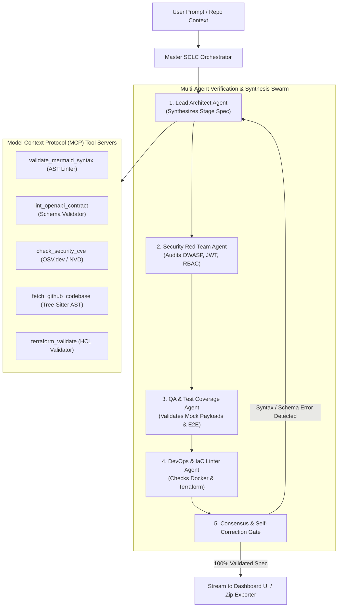
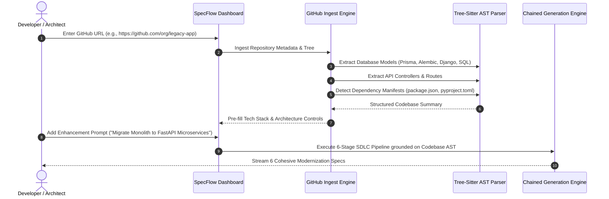

# Advanced Training, Tooling & Codebase Ingestion Guide for SpecFlow AI

This guide details the architectural blueprint and engineering roadmap to scale **SpecFlow AI** into an enterprise-grade autonomous software architect. It covers **Model Context Protocol (MCP)** tool calling, **GitHub repository ingestion (Repo-RAG)**, **custom LLM fine-tuning pipelines (LoRA/QLoRA)**, and **multi-agent self-correcting verification loops**.

---

## 1. Multi-Agent Orchestration & Tool Calling (MCP)



### 1.1 Model Context Protocol (MCP) Integration
SpecFlow AI can connect to external MCP servers to execute deterministic linting tools during stage generation:
- **`validate_mermaid_syntax`**: Parses generated Mermaid blocks through the official `mermaid-cli` AST parser. If a syntax error is caught, the agent is prompted with the exact parser error to auto-correct the diagram before user delivery.
- **`lint_openapi_contract`**: Validates JSON request/response schemas against OpenAPI 3.1 specifications using `@stoplight/spectral` or `openapi-spec-validator`.
- **`check_security_cve`**: Interrogates the OSV.dev and National Vulnerability Database (NVD) APIs to ensure recommended libraries (e.g., Node packages, Python wheels) have zero known Critical/High CVEs.
- **`terraform_validate`**: Runs headless HCL parsing on generated `main.tf` snippets in `05_DEPLOYMENT_DEVOPS.md`.

---

## 2. GitHub Codebase Ingestion (Brownfield & Modernization)

SpecFlow AI is not limited to greenfield projects. It can ingest existing GitHub repositories to generate refactoring specs, microservice decompositions, or migration architectures.



### 2.1 AST Extraction Strategy
1. **Schema Discovery:** Scans for `.prisma`, `models.py`, `schema.sql`, `entities/`, and `migrations/` to reverse-engineer the existing database ERD.
2. **Route Discovery:** Scans Express routers, FastAPI decorators (`@app.get`), Next.js route handlers (`app/api/**/route.ts`), and Spring controllers to construct the existing API catalog.
3. **Infrastructure Discovery:** Analyzes `Dockerfile`, `docker-compose.yml`, Helm charts, and Terraform folders to extract the current deployment baseline.

---

## 3. Dataset Curation & Fine-Tuning Pipelines

To create a specialized open-weight model (e.g., `SpecFlow-Llama-3.3-70B` or `SpecFlow-DeepSeek-R1`) that excels at drafting software specifications without hallucination, follow this training recipe.

### 3.1 Training Dataset Construction

| Dataset Split | Source Material | Size | Purpose |
| :--- | :--- | :--- | :--- |
| **`sdlc-greenfield-paired`** | High-level PRDs paired with full 6-stage human-reviewed specifications. | 35,000 examples | Core instruction tuning for end-to-end SDLC synthesis. |
| **`architecture-rfcs`** | Public RFCs and architecture decision records (ADRs) from Uber, Netflix, GitLab, and AWS. | 10,000 examples | Industry-standard trade-off justifications and topologies. |
| **`mermaid-syntax-gold`** | Validated, complex Mermaid Flowcharts, ERDs, and Sequence diagrams. | 15,000 examples | Zero-syntax-error diagram generation. |
| **`security-compliance-matrix`** | OWASP benchmark cases, HIPAA/SOC2 compliance matrices, and NIST 800-53 controls. | 8,000 examples | Robust threat modeling and RBAC specifications. |

### 3.2 Fine-Tuning Execution Script (QLoRA with Unsloth)

```python
"""
SpecFlow AI: QLoRA Fine-Tuning Pipeline for SDLC Spec Generation
Target Base Model: unsloth/Llama-3.3-70B-Instruct-bnb-4bit
"""

import torch
from unsloth import FastLanguageModel
from datasets import load_dataset
from trl import SFTTrainer
from transformers import TrainingArguments

# 1. Configuration & GPU Setup
max_seq_length = 8192
dtype = torch.bfloat16 if torch.cuda.is_bf16_supported() else torch.float16
load_in_4bit = True

# Ensure execution defaults to GPU/CUDA
device = torch.device("cuda" if torch.cuda.is_available() else "cpu")
print(f"Executing training on compute device: {device}")

# 2. Load Base Model & Tokenizer
model, tokenizer = FastLanguageModel.from_pretrained(
    model_name="unsloth/Llama-3.3-70B-Instruct-bnb-4bit",
    max_seq_length=max_seq_length,
    dtype=dtype,
    load_in_4bit=load_in_4bit,
)

# 3. Attach LoRA Parameter-Efficient Adapters
model = FastLanguageModel.get_peft_model(
    model,
    r=32,
    target_modules=["q_proj", "k_proj", "v_proj", "o_proj", "gate_proj", "up_proj", "down_proj"],
    lora_alpha=64,
    lora_dropout=0.05,
    bias="none",
    use_gradient_checkpointing="unsloth",
    random_state=42,
)

# 4. Load Curated SDLC Specification Dataset
dataset = load_dataset("specflow-ai/sdlc-specifications-corpus", split="train")

# 5. Configure Hyperparameters & Optimizer
training_args = TrainingArguments(
    per_device_train_batch_size=2,
    gradient_accumulation_steps=8,
    warmup_ratio=0.05,
    max_steps=3000,
    learning_rate=2e-4,
    fp16=not torch.cuda.is_bf16_supported(),
    bf16=torch.cuda.is_bf16_supported(),
    logging_steps=10,
    optim="adamw_8bit",
    weight_decay=0.01,
    lr_scheduler_type="cosine",
    seed=42,
    output_dir="./outputs/specflow-70b-v1",
)

# 6. Train Model
trainer = SFTTrainer(
    model=model,
    tokenizer=tokenizer,
    train_dataset=dataset,
    dataset_text_field="text",
    max_seq_length=max_seq_length,
    dataset_num_proc=4,
    packing=False,
    args=training_args,
)

trainer.train()

# 7. Save GGUF and LoRA Weights for Ollama & vLLM Serving
model.save_pretrained_merged("./models/specflow-70b-merged", tokenizer, save_method="merged_16bit")
model.save_pretrained_gguf("./models/specflow-70b-gguf", tokenizer, quantization_method="q4_k_m")
```

---

## 4. Reinforcement Learning from Compiler Feedback (RLCF)

In addition to supervised fine-tuning (SFT), SpecFlow AI benefits from **Reinforcement Learning from Compiler Feedback (RLCF)** using Direct Preference Optimization (DPO) or Group Relative Policy Optimization (GRPO):

1. **Reward Signal 1 (Diagram Validity):** +1.0 if Mermaid code renders valid SVG via `mermaid-cli`; -2.0 if parser errors occur.
2. **Reward Signal 2 (Schema Integrity):** +1.0 if OpenAPI and JSON schema blocks pass strict JSON-schema validation.
3. **Reward Signal 3 (Cross-Document Consistency):** +2.0 if all entities defined in `01_SYSTEM_ARCHITECTURE.md` are referenced in `02_IMPLEMENTATION_PLAN.md` and `03_TESTING_STRATEGY.md`.
4. **Reward Signal 4 (No AI Watermarks):** -5.0 if the output contains conversational filler or AI attribution markers.

---

## 5. Architectural Knowledge Graph & Hybrid RAG

To support deep enterprise domains (e.g., Banking Core Banking, Healthcare HL7/FHIR, Automotive AUTOSAR, Defense DoD IL5), integrate a **Hybrid Vector + Knowledge Graph RAG**:

- **Vector Layer (pgvector / Qdrant):** Dense embeddings (e.g. `text-embedding-3-large` or `bge-large-en-v1.5`) indexing 10,000+ cloud architecture blueprints, AWS Well-Architected Framework whitepapers, and Martin Fowler pattern catalogs.
- **Knowledge Graph Layer (Neo4j):** Connects architectural patterns (e.g., `Event Sourcing -> requires -> Kafka`, `CQRS -> requires -> Read Model Sync`, `OAuth2 -> requires -> Refresh Token Rotation`).
- **Query Injection:** During Stage 1 prompt compilation, the orchestrator queries the graph for relevant architectural invariants and injects them directly into the context window.
