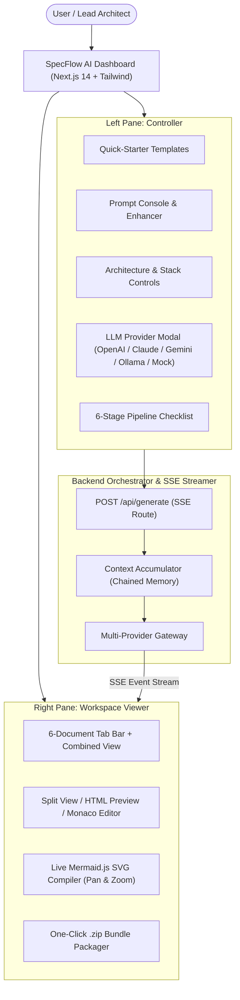

# SpecFlow AI: Automated Spec-Driven Development Dashboard & Artifact Generator

> **SpecFlow AI** transforms high-level natural language application descriptions into an end-to-end, production-ready software specification suite structured into 6 sequential, industry-standard Markdown files with real-time SSE streaming, live Mermaid.js diagram compilation, Monaco editor, and one-click `.zip` export.

---

## 📑 Specification Suite Index

| Stage | Document | Purpose & Scope | Key Artifacts Included |
| :---: | :--- | :--- | :--- |
| **00** | [**`00_PROJECT_BRIEF.md`**](./00_PROJECT_BRIEF.md) | Product Scope & Requirements | Personas, P0/P1/P2 Matrix, Non-Functional SLAs, In/Out Scope Boundaries |
| **01** | [**`01_SYSTEM_ARCHITECTURE.md`**](./01_SYSTEM_ARCHITECTURE.md) | System Design & Contracts | Technology Justification, Mermaid Topology, Mermaid ERD, API Contracts, Sequence Flows |
| **02** | [**`02_IMPLEMENTATION_PLAN.md`**](./02_IMPLEMENTATION_PLAN.md) | Engineering Breakdown | Repository Tree, 4-Phase Milestones, Dependency-Chained Task Checklist, Local Dev Setup |
| **03** | [**`03_TESTING_STRATEGY.md`**](./03_TESTING_STRATEGY.md) | Quality Assurance Matrix | Unit Matrix (>80% Target), API Mock Test Suites, Playwright E2E User Flows, Edge-Case Inventory |
| **04** | [**`04_SECURITY_COMPLIANCE.md`**](./04_SECURITY_COMPLIANCE.md) | Security & Hardening | Identity & RBAC Matrix, OWASP Top 10 Blueprint, TLS 1.3 / AES-256 Crypto, Env Var Dictionary |
| **05** | [**`05_DEPLOYMENT_DEVOPS.md`**](./05_DEPLOYMENT_DEVOPS.md) | Infrastructure & Operations | Multi-stage Dockerfile, docker-compose.yml, GitHub Actions CI/CD, Terraform IaC, Healthz & Metrics |

---

## 🚀 Key Features

- ⚡ **Sequential Context Chaining:** Generates specs stage-by-stage where each phase consumes the accumulated outputs of previous phases to guarantee 100% architectural and naming coherence.
- 📡 **Real-Time Server-Sent Events (SSE):** Token streaming over HTTP readable streams with live stage progress indicators and duration counters.
- 📊 **Live Mermaid.js Diagram Engine:** Automatic compilation of Mermaid flowcharts, ERDs, sequence diagrams, and Gantt charts with pan/zoom and fullscreen inspection.
- ✏️ **In-Place Monaco Code Editor:** Toggle between rendered GitHub Flavored Markdown and the Monaco Editor (VS Code in the browser) for live edits.
- 📦 **One-Click Batch ZIP Export:** Client-side packaging of `.specs/` folder with all 6 Markdown documents and an auto-generated root `README.md` index.
- 🤖 **Multi-Provider LLM Gateway:** Native support for OpenAI (`gpt-4o`), Anthropic (`claude-3-5-sonnet`), Google Gemini (`gemini-2.0-flash`), Groq (`llama-3.3-70b`), Local Ollama, and a built-in **High-Fidelity Synthesizer Mode** for zero-setup instant execution.
- 🎯 **Pre-Configured Architecture Presets:** Quick-starters for E-Commerce Microservices, Real-Time Collab Messenger, HIPAA Telehealth, AI Multi-Agent Workflow, Fintech Ledger, and B2B SaaS Analytics.

---

## 🏗️ Technical Architecture



---

## ⚡ Quick Start & Local Development

### Prerequisites
- Node.js `v18.0.0` or higher
- npm `v9.0.0` or higher

### Installation & Run

```bash
# 1. Clone the repository
git clone https://github.com/tarun1790/spec6.git
cd spec6

# 2. Install dependencies
npm install

# 3. Start local development server
npm run dev

# 4. Open in browser
# Visit http://localhost:3000
```

### Production Build & Containerization

```bash
# Build standalone Next.js bundle
npm run build
npm start

# Or run with Docker Compose
docker compose up -d
```

---

## 📂 Repository Structure

```text
.
├── 00_PROJECT_BRIEF.md
├── 01_SYSTEM_ARCHITECTURE.md
├── 02_IMPLEMENTATION_PLAN.md
├── 03_TESTING_STRATEGY.md
├── 04_SECURITY_COMPLIANCE.md
├── 05_DEPLOYMENT_DEVOPS.md
├── specs/                         # Mirrored specifications directory
├── src/
│   ├── app/                       # Next.js App Router & SSE endpoints
│   ├── components/                # React dashboard components & editors
│   └── lib/                       # LLM orchestration, prompts, templates, exporter
├── Dockerfile
├── docker-compose.yml
├── Makefile
├── package.json
└── README.md
```
