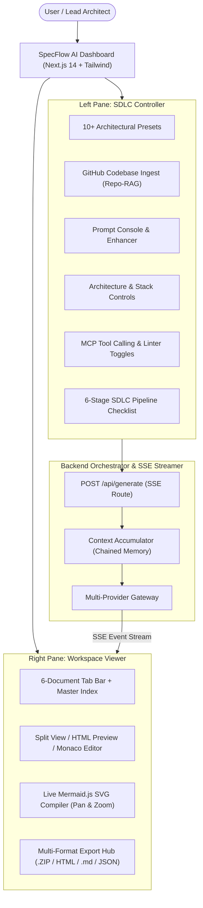

# SpecFlow AI: Automated Spec-Driven Development Dashboard & Artifact Generator

[](https://tarun1790.github.io/spec6/)
[](https://opensource.org/licenses/MIT)
[](https://nextjs.org/)
[](https://tailwindcss.com/)

> **SpecFlow AI** transforms high-level natural language application descriptions and GitHub repositories into an end-to-end, production-ready software specification suite structured into 6 sequential, industry-standard Markdown files with real-time SSE streaming, live Mermaid.js diagram compilation, Monaco editor, and multi-format export.

🌐 **Live Web Application (GitHub Pages):** [**https://tarun1790.github.io/spec6/**](https://tarun1790.github.io/spec6/)  
📂 **Source Code Repository:** [**https://github.com/tarun1790/spec6**](https://github.com/tarun1790/spec6)

---

## 📑 6-Stage SDLC Specification Suite Index

| Stage | SDLC Phase | Specification Document | Key Artifacts Included |
| :---: | :--- | :--- | :--- |
| **00** | **Phase 1: Requirements Analysis** | [**`00_PROJECT_BRIEF.md`**](./00_PROJECT_BRIEF.md) | 4 Personas, P0/P1/P2 Requirements Matrix, Non-Functional SLAs (99.99%, sub-50ms p95), In/Out Scope Boundaries |
| **01** | **Phase 2: System & Schema Design** | [**`01_SYSTEM_ARCHITECTURE.md`**](./01_SYSTEM_ARCHITECTURE.md) | Tech Stack Rationale, Mermaid Topology, Mermaid ERD Schemas, REST/SSE API Contracts, Event Sequence Flow |
| **02** | **Phase 3: Software Development** | [**`02_IMPLEMENTATION_PLAN.md`**](./02_IMPLEMENTATION_PLAN.md) | Repository Tree, 4-Phase Gantt Milestones, 20+ Dependency-Chained Tasks (`- [ ]`), Local CLI Setup |
| **03** | **Phase 4: Quality Assurance & Testing** | [**`03_TESTING_STRATEGY.md`**](./03_TESTING_STRATEGY.md) | Unit Matrix (>80% Target), API Mock Test Suites, Playwright E2E Master Test Script, Edge-Case Inventory |
| **04** | **Phase 5: Security & Hardening** | [**`04_SECURITY_COMPLIANCE.md`**](./04_SECURITY_COMPLIANCE.md) | Identity & RBAC Matrix, OWASP Top 10 Mitigation Blueprint, TLS 1.3 / AES-256 Crypto, Env Var Dictionary |
| **05** | **Phase 6: Deployment & Operations** | [**`05_DEPLOYMENT_DEVOPS.md`**](./05_DEPLOYMENT_DEVOPS.md) | Multi-stage Dockerfile, docker-compose.yml, GitHub Actions CI/CD (`deploy.yml`), Terraform IaC, `/api/health` |

---

## 🚀 Key Features & Capabilities

- ⚡ **Sequential Context Chaining:** Generates specs stage-by-stage where each phase consumes the accumulated outputs of previous phases to guarantee 100% architectural and naming coherence.
- 📡 **Real-Time Server-Sent Events (SSE):** Live token streaming over HTTP readable streams with stage progress indicators and duration counters.
- 📊 **Live Mermaid.js Diagram Engine:** Automatic compilation of Mermaid flowcharts, ERDs, sequence diagrams, and Gantt charts with pan/zoom and fullscreen inspection.
- ✏️ **In-Place Monaco Code Editor:** Toggle between rendered GitHub Flavored Markdown and the Monaco Editor (VS Code in the browser) for live edits and side-by-side diff comparison.
- 🐙 **GitHub Codebase Ingestion (Repo-RAG):** Paste any public/private GitHub URL to automatically reverse-engineer AST directory trees, database models, and routes for Greenfield OR Brownfield refactoring.
- 🛠️ **Model Context Protocol (MCP) Tool Suite:** Equipped with Mermaid AST linters, OpenAPI 3.1 contract validators, OSV.dev CVE vulnerability scanners, and cross-document coherence checkers.
- 📦 **Multi-Format Export Hub:** One-click download as a `.ZIP` bundle (`.specs/` + `README.md`), Master Markdown document, Standalone HTML presentation deck, or JSON OpenAPI manifest.
- 🤖 **Multi-Provider LLM Gateway:** Native support for OpenAI (`gpt-4o`, `o1`), Anthropic (`claude-3-5-sonnet`), Google Gemini (`gemini-2.0-flash`), Groq (`llama-3.3-70b`), DeepSeek, Ollama, and a built-in **High-Fidelity Synthesizer Mode** for zero-setup instant execution.
- 🎯 **10+ Pre-Configured SDLC Presets:**
  - *E-Commerce Event-Driven Microservices*
  - *Real-Time Collaborative Workspace & Chat*
  - *Healthcare Telemedicine & HIPAA Portal*
  - *Autonomous Multi-Agent AI Workflow Orchestrator*
  - *Fintech Multi-Currency Ledger & Payments*
  - *B2B SaaS Multi-Tenant Analytics*
  - *IoT Edge Sensor Mesh & Telemetry*
  - *Video Streaming & Global Transcoding CDN*
  - *Web3 Smart Contract Vault & Escrow*
  - *Cyber SIEM & Automated Threat Hunting*

---

## 🏗️ System Architecture



---

## ⚡ Quick Start & Local Development

### Prerequisites
- Node.js `v18.0.0` or higher
- npm `v9.0.0` or higher

### Installation & Run

```bash
# 1. Clone the repository
git clone https://github.com/tarun1790/spec6.git
cd spec6

# 2. Install dependencies
npm install

# 3. Start local development server
npm run dev

# 4. Open in browser
# Visit http://localhost:3000
```

### Production Build & Containerization

```bash
# Standalone Next.js production build
npm run build
npm start

# Containerized execution with Docker Compose
docker compose up -d
```

---

## 📚 Advanced Documentation

- [**`ADVANCED_TRAINING_AND_TOOLING.md`**](./ADVANCED_TRAINING_AND_TOOLING.md): Detailed guide covering fine-tuning pipelines (QLoRA on Llama 3.3 / DeepSeek-R1), Reinforcement Learning from Compiler Feedback (RLCF), and Model Context Protocol (MCP) server integration.
- [**`00_PROJECT_BRIEF.md`**](./00_PROJECT_BRIEF.md): Scope & Requirements Matrix.
- [**`01_SYSTEM_ARCHITECTURE.md`**](./01_SYSTEM_ARCHITECTURE.md): System Design & Contracts.
- [**`02_IMPLEMENTATION_PLAN.md`**](./02_IMPLEMENTATION_PLAN.md): Engineering Breakdown & Tasks.
- [**`03_TESTING_STRATEGY.md`**](./03_TESTING_STRATEGY.md): Quality Assurance & E2E Testing.
- [**`04_SECURITY_COMPLIANCE.md`**](./04_SECURITY_COMPLIANCE.md): Security & Hardening.
- [**`05_DEPLOYMENT_DEVOPS.md`**](./05_DEPLOYMENT_DEVOPS.md): DevOps & Infrastructure.
